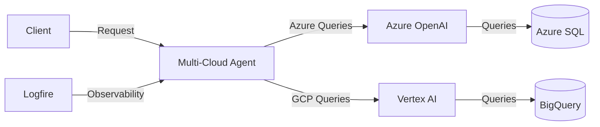

<div align="center">

# Multi-Cloud Agent 🌥️🤖

[](LICENSE)
[](https://www.python.org/downloads/release/python-3130/)
[](https://docs.pydantic.dev/latest/integrations/ai/)
[](https://logfire.sh/)
[](https://docs.astral.sh/uv/)

> Multi-cloud database operations with integrated observability and AI query processing.

</div>

## 📑 Table of Contents
- [Overview](#-overview)
- [Features](#-features)
- [Getting Started](#-getting-started)
  - [Prerequisites](#prerequisites)
  - [Installation](#️-installation)
- [Architecture](#️-architecture)
- [Usage](#-usage)
- [Observability](#-observability)
- [Contributing](#-contributing)
- [Resources](#-resources)
- [License](#-license)

## Overview

The Multi-Cloud Agent unifies Azure OpenAI and Google Vertex AI capabilities into a single interface. Built with PydanticAI and enhanced by Logfire observability, it enables developers to execute complex queries across cloud platforms while maintaining enterprise-grade monitoring and reliability.

### Features

- **Multi-Cloud Operations**
  - Unified interface for Azure SQL and Google BigQuery
  - Standardized query routing and execution
  - Consistent error handling and response formatting

- **AI Integration**
  - Natural language query processing via Azure OpenAI
  - Query optimization through Vertex AI
  - Automated execution planning

- **Observability**
  - Distributed tracing with Logfire
  - Query performance metrics
  - Real-time monitoring

## Getting Started

### Prerequisites

Required components:

- Python 3.13+
- uv package manager
- Azure account with OpenAI access
- GCP account with Vertex AI enabled

### Installation

1. Clone and Setup

```bash
git clone https://github.com/your-username/multi-cloud-agent
cd multi-cloud-agent
curl -LsSf https://astral.sh/uv/install.sh | sh
```

2. Create Environment

```bash
uv venv
source .venv/bin/activate  # Windows: .venv\Scripts\activate
```

3. Install Dependencies

```bash
uv pip install -e ".[dev]"
```

## Architecture



## Usage

```python
from multi_cloud_agent import MultiCloudAgent

# Initialize agent
agent = MultiCloudAgent()

# Execute cross-platform query
query = """
SELECT COUNT(*) as record_count
FROM my_table
WHERE created_at >= CURRENT_TIMESTAMP - INTERVAL '1 day'
"""

results = await agent.execute_query(query)
print(f"Azure Results: {results.azure_result}")
print(f"Vertex Results: {results.vertex_result}")
```

## Observability

Logfire integration provides distributed tracing and monitoring:

```python
import logfire

# Configure monitoring
logfire.configure(
    service_name="multi-cloud-agent",
    environment="production"
)

# Automatic tracing
with logfire.span("execute_query"):
    results = await agent.execute_query(query)
```

## Contributing

1. Fork repository
2. Create feature branch (`git checkout -b feature/NewFeature`)
3. Run tests (`pytest`)
4. Lint code (`ruff check .`)
5. Commit changes (`git commit -m 'Add NewFeature'`)
6. Push branch (`git push origin feature/NewFeature`)
7. Open Pull Request

## Resources

- [PydanticAI Documentation](https://docs.pydantic.dev/latest/integrations/ai/)
- [Logfire Documentation](https://logfire.sh/docs)
- [Azure OpenAI Service](https://azure.microsoft.com/en-us/products/cognitive-services/openai-service)
- [Google Vertex AI](https://cloud.google.com/vertex-ai)

## License

MIT License - see [LICENSE](LICENSE) file for details.
